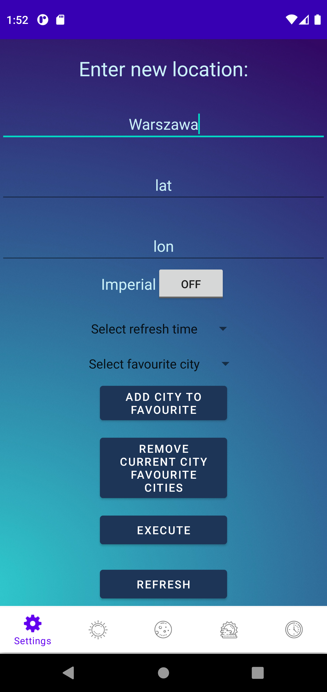
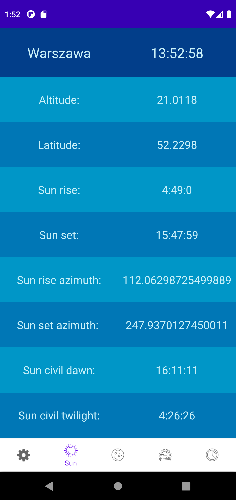
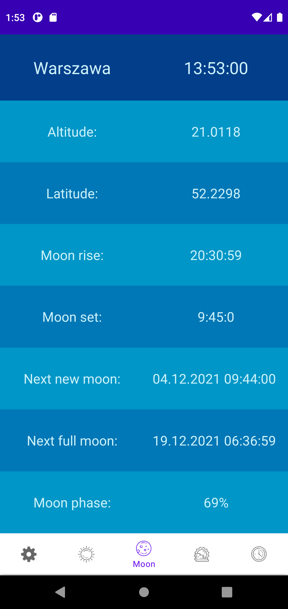
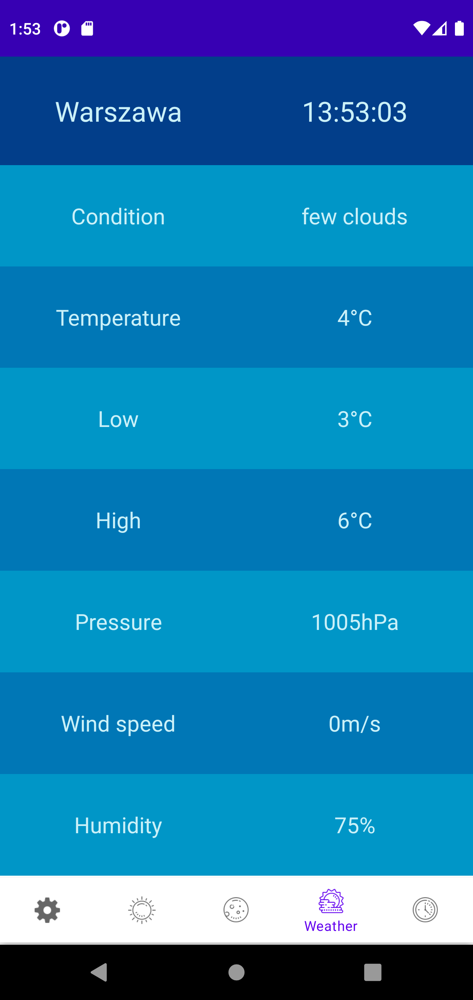
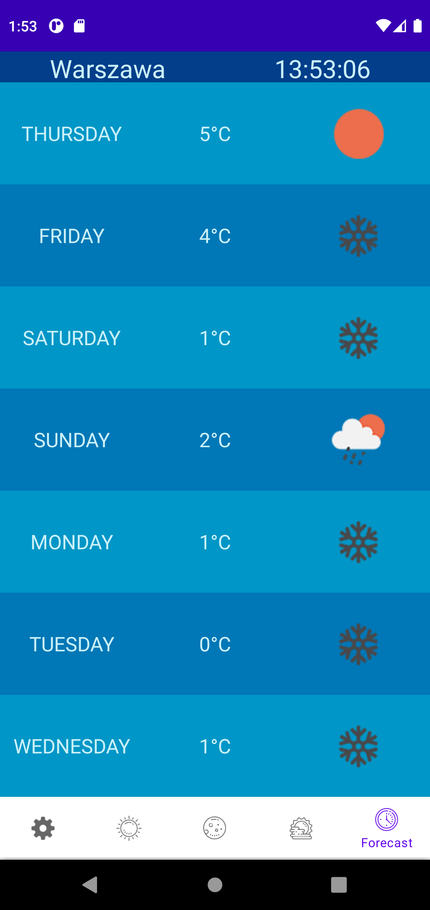

# Astroweather
Application was created for laboratories on my university classes. 
It's goal is to display calculations about sun and moon, display weather predictions.

# Usage 
You can type city you want to check weather in, or you can type coordinates. Then you have to click execute to get data about this place.

Informations about weather are on the next pages.

## Features
- list of favourite Cities
- switching to imperial units system
- caching last searched city

